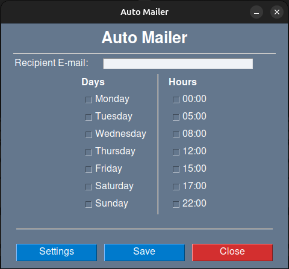

# AutoMailer - Random Dog Picture Email Scheduler 🐶✉️📅



## Description
**AutoMailer** is a Python-based application that automatically sends random dog pictures to a specified email address according to a user-defined schedule. Configure your recipient, sender details, and choose specific days and times for the cutest canine surprises in your inbox.

## Features
- 🖥️ **User-friendly GUI** for easy configuration
- 📅 **Schedule emails** by day and time
- 🐕 **Random dog picture** integration
- 📋 **Detailed logging** for monitoring and debugging

## Technologies Used
- **Python**
- **[PySimpleGUI](https://pysimplegui.readthedocs.io/)** (or another GUI library you're using)
- **[PyInstaller](https://www.pyinstaller.org/)**
- **[Dog API](https://thedogapi.com/)**
- **sched** and **threading** for task scheduling

## Getting Started
### Prerequisites
- **Python 3.12+**
- Required libraries: `sched`, `threading`, `requests`, `json`, `os`, `sys`, `logging`, `PySimpleGUI`

### Installation
1. **Clone the repository**:
    ```sh
    git clone https://github.com/GeovaneDev54/AutoMailer.git
    cd AutoMailer
    ```

2. **Create a virtual environment**:
    ```sh
    python -m venv venv
    source venv/bin/activate  # On Windows use `venv\Scripts\activate`
    ```

3. **Install the required dependencies**:
    ```sh
    pip install -r requirements.txt
    ```

### Usage
1. **Run the application**:
    ```sh
    python src/main.py
    ```

2. **Configure your schedule**: Use the user-friendly GUI to set up your recipient email, sender details, and the schedule for sending random dog pictures.

3. **Enjoy random dog pictures** in your inbox as per the schedule!

### Building the Executable
To build a standalone executable for Windows using PyInstaller, follow these steps:
1. **Activate your virtual environment**:
    ```sh
    source venv/bin/activate  # On Windows use `venv\Scripts\activate`
    ```

2. **Run PyInstaller**:
    ```sh
    pyinstaller main.spec
    ```

3. **Find your executable** in the `dist` directory.

### Download
You can download the precompiled versions of AutoMailer for different platforms:

- [AutoMailer for Windows](https://github.com/GeovaneDev54/AutoMailer/raw/main/AutoMailer_Windows.zip)
- [AutoMailer for Linux](https://github.com/GeovaneDev54/AutoMailer/raw/main/AutoMailer_Linux.zip)

## Contributing
Contributions are welcome! Please create an issue or submit a pull request with your improvements or bug fixes.

## License
This project is licensed under the MIT License - see the [LICENSE](LICENSE) file for details.

## Acknowledgements
- Thanks to the creators of [PySimpleGUI](https://pysimplegui.readthedocs.io/) for their excellent library.
- Special thanks to [Dog API](https://thedogapi.com/) for providing adorable dog pictures.

---

Made with ❤️ by [GeovaneDev54](https://github.com/GeovaneDev54)
